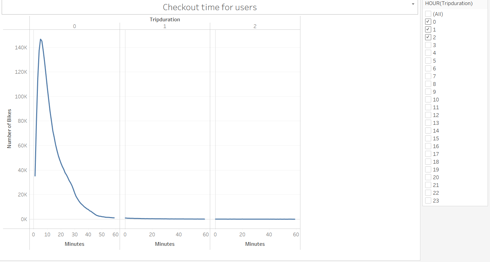
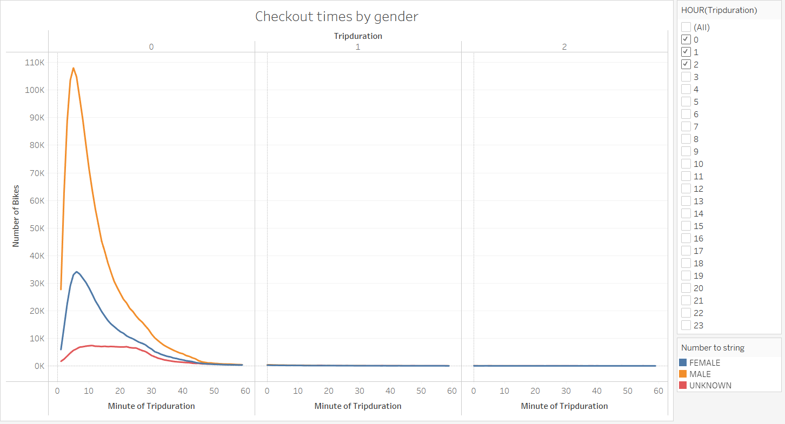
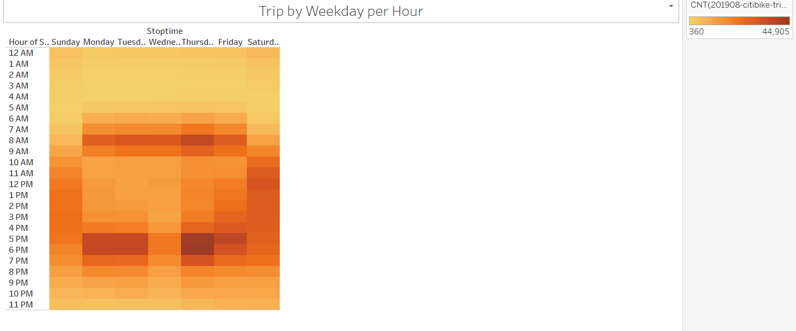
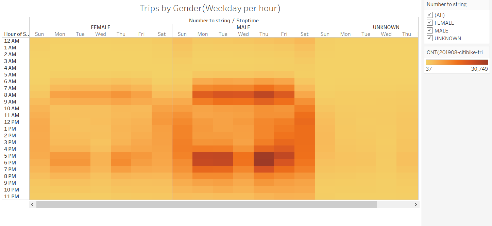
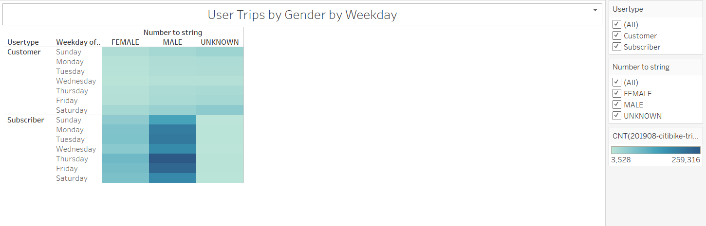
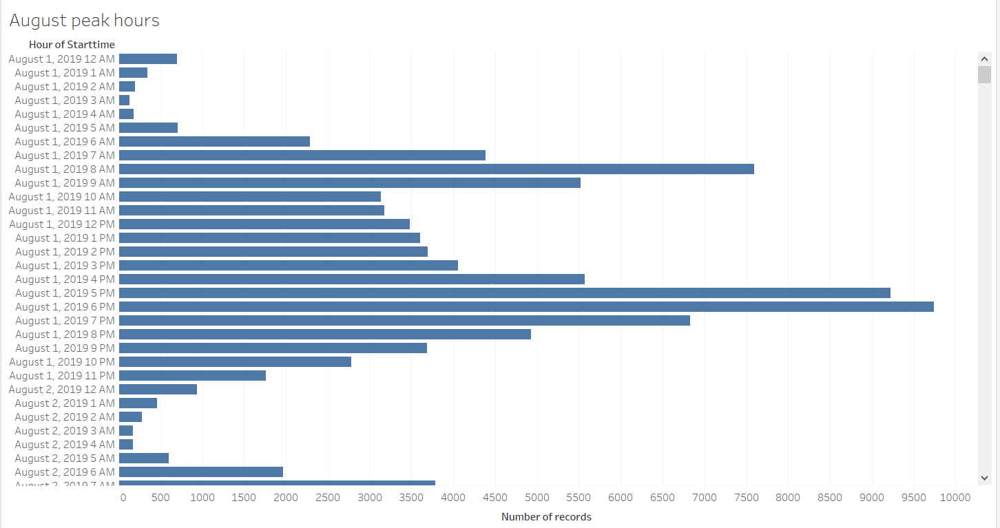
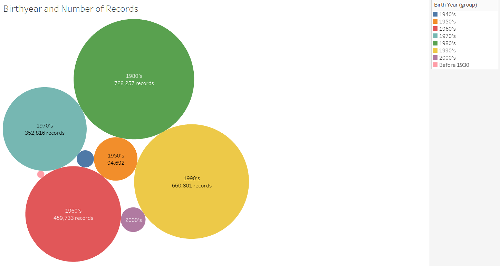
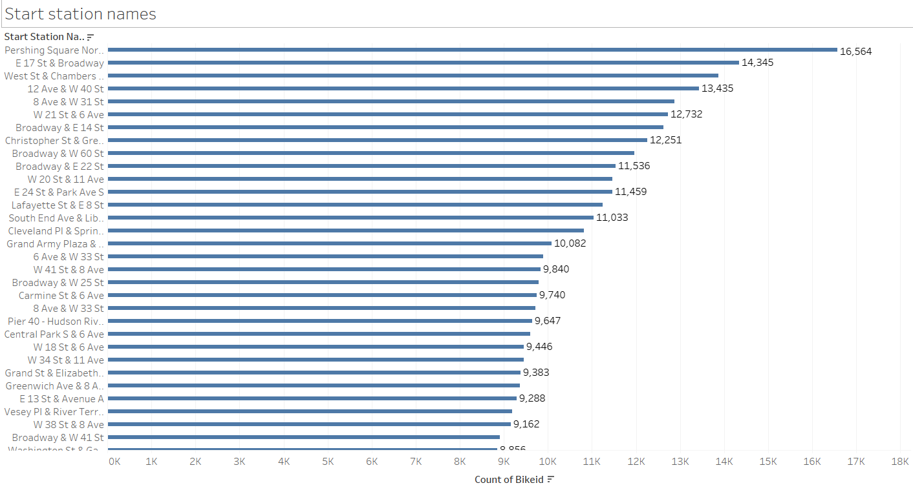

# Bikesharing
Create a data visualization for the NYC Citi bike sharing data using Tableau.

## Purpose and Overview of the project
Tableau is a powerful tool used to create data visualizations that are visually appealing and easy for a non technical user to understand. In this analysis using the NYC bike sharing
data , we have analysed and created data visualizations that can help to bring up bike sharing plans in the city of Des Moines. We have collected  the data for 2019 for the month 
of August for the Citi bikes in NYC. Based on different factors like starting and ending stations, start and stop time, trip duration, gender breakdown and so on , we have created various
data visualizations that can help to propose a successful bike sharing plan for the city of Des Moines. The different features of Tableau like worksheets , dashboards and stories have helped
us to create and represent this data systematically in the form of various graphs. 

## Results

	Below is the link to the tableau dashboard:

[link to tableau dashboard](https://public.tableau.com/views/TableauChallengeNYCcitibikeanalysis/NYCCitibikeAnalysis?:language=en-US&:display_count=n&:origin=viz_share_link)

	
1. 

	The above graph shows the length of time for which the bikes are checked out for all the riders. We have filtered the 0th , 1st and 2nd hours and their respective minutes time is
	plotted on the graph on X axis. As we can see the number of bikes checked out is maximum for the time duration of 10 minutes and is then slowly reducing. We can say that a particular 
	rider usually rents a bike for a short duration like for 10-15 minutes.

2. 

	The above graph shows the length of time for which bikes are checked out for the riders based on their gender. As we can see the maximum number of bikes have been checked out by
	male riders for around 5 minutes each. So we can say that more male riders rent a bike for short durations in the NYC followed by female and other riders.
	
3. 

	The above heatmap shows the number of bike trips by weekday for each hour of the day. We can see that on Thursdays at around 5pm-6pm maximum number of bikes have been used by all
	the riders.Also on Thursdays during morning 8am quite a good number of bikes have been used. So evening times are mostly preferred with Thursdays being the busiest day of the week.

4. 	

	The above heatmap shows the number of bike trips by weekday for each hour of the day based on the gender. Here we see that the maximum number of bikes are used by male population
	in the NYC during Thursdays at around 5pm-6pm. Female and other population comparatively use lesser bikes than male population. Again Thursdays seems to be the most preferable day 
	for the male and female riders to rent bikes.
	
5. 
	
	The above heatmap shows the number of bike trips by weekday for each hour of the day based on the gender and the user types : customer and subscribers. As we can see there are
	more male subscribers than the male customers who are taking bikes in the NYC. The male subscribers are utilizing the maximum number of bikes on Thursdays.
	Also the number of male subscribers using bikes is quite high on Fridays. For female subscribers also Thursdays and Fridays are the most preferred days of the week to take a bike.
	
6. 

	Based on the above graph the top riding hours in the month of August in the NYC is from 5pm to 7pm. Its the most active time of the day when all the riders prefer to rent a 
	bike. Also we can see that 2am to 5am is the least active riding times. This can make this time favourable for a maintenance as during this time very fewer bikes will be needed.
	
7. ![bike_repair]](./Resources/bike_repair.png)

	The above treemap shows how often a bike is used. With this we can determine the bike id that are most frequently used and hence needs the most maintenance. For example
	bike id 38124 has been used 479 times which is the highest as compared to other bikes, so definitely it will need the most maintenance and repair. Repairing the bikes is a
	very crucial factor to be considered for the safety of the riders as well as for smooth functioning of the citi bikes.
	
## Summary

1. In the NYC majority of the population riding bikes are males who are mostly subscribers.

2. The most popular hours of ride is during the evening from 5pm to 7pm and its observed that on Thursdays and Fridays of the week maximum rides are taken.

3. The bikes with maximum tripduration and those which are most frequently used needs to be repaired and provide extra maintenance keeping in mind the safety of the riders.

4.  

	The graph above shows that mid-aged people in the city ride the maximum number of bikes. It shows the distribution of the population riding the bikes based on their age.
	
5.  

	The graph above shows the most popular starting stations in the NYC where most number of riders start their bike ride from. Based on this we can further check the popular locations
	and increase the availability of bikes in those particular locations.
	
	

	
	

	

	
	
